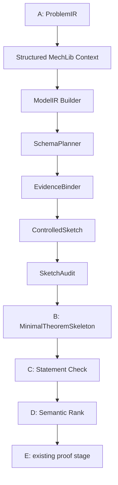

# Minimal Skeleton Pipeline

This document describes the front-half formalization flow enabled by:

```yaml
statement:
  generation_mode: minimal_skeleton
```

Legacy runs keep using `generation_mode: legacy_candidate`.

## Flow



The new stages run before B and are only active in minimal skeleton mode.

## Core Artifacts

`ModelIR` records the modeling interpretation of a problem. It separates problem facts, coordinate conventions, local definitions, model instances, target, and forbidden assumptions.

`EvidenceBinding` links each model instance to eligible MechLib declarations. A binding is proof-eligible only when it names a verified declaration that passed the configured eligibility rules. If no declaration is found, the binding records `gap_schema_only` instead of inventing a MechLib name.

`ControlledSketch` records the intended reasoning steps before Lean skeleton generation. Law applications and constraints stay as steps and proof obligations, not as ordinary theorem hypotheses.

`TheoremSkeletonCandidate` extends `StatementCandidate` while preserving all legacy fields. It adds provenance, evidence bindings, proof obligations, selected laws, verified declarations, gap laws, and skeleton audit data.

## Schema vs Verified Declaration

Schema rows are modeling metadata. They help choose the right physical law or problem pattern, but they are not proof facts.

Verified declarations are Lean declarations from MechLib corpus rows that satisfy the configured eligibility checks, including declaration status and LLM-callable flags. Only these declarations can appear in proof-eligible binding fields.

Alignment, concept, problem schema, and law schema metadata can guide planning. They must not be written as `verified_decl` or counted as verified MechLib use.

## B Hypothesis Rules

Minimal skeleton mode allows theorem hypotheses with these roles:

- `problem_fact`
- `coordinate_convention`
- `local_definition`
- `model_instance`
- `explicit_gap_law`

Forbidden as ordinary hypotheses:

- final target
- candidate answer
- law application equation
- algebra elimination result
- unsupported derived equation
- schema, concept, alignment, interface, residual, or example metadata as proof fact

When a law application has a verified declaration, B keeps the expected claim in `proof_obligations`. It should not move that equation into theorem hypotheses.

When a law has no verified declaration and explicit gap laws are enabled, B may include an `explicit_gap_law` hypothesis. It must have provenance with `source_type=gap` and `proof_fact_allowed=false`; it is not verified MechLib use.

## Prompt Contracts

`prompts/A2_model_ir.txt` asks for controlled JSON ModelIR only. It must not generate Lean declarations or proof text.

`prompts/controlled_sketch.txt` asks for controlled JSON sketch steps. Each law or constraint step must point to a model instance, schema hint, and either an evidence binding or gap status.

`prompts/B_generate_minimal_skeleton.txt` asks for JSON theorem skeleton candidates. It preserves proof obligations and provenance, and keeps derived law claims out of normal hypotheses.

## Output Files

Minimal skeleton runs write these additional JSONL artifacts:

- `model_ir.jsonl`
- `structured_mechlib_context.jsonl`
- `evidence_bindings.jsonl`
- `controlled_sketch.jsonl`
- `sketch_audit.jsonl`
- `theorem_skeleton_candidates.jsonl`

They are written into `runs/<run>/` and mirrored into `outputs/latest/` by the existing archive writer.

## Metrics

Minimal skeleton runs add:

- `model_ir_success_rate`
- `evidence_binding_success_rate`
- `verified_binding_rate`
- `gap_schema_only_rate`
- `sketch_audit_pass_rate`
- `skeleton_generation_success_rate`
- `derived_equation_hypothesis_violation_rate`
- `schema_as_proof_fact_violation_rate`
- `explicit_gap_law_rate`

Legacy runs can report these as `null`.

## E Stage Handoff

The current E stage remains unchanged. Future E work should consume:

- `proof_obligations`
- `verified_decls`
- `evidence_bindings`
- `controlled_sketch`
- `hypothesis_provenance`

The intended direction is to prove law application claims inside E using verified declarations and local theorem hypotheses, rather than letting B place those law results directly into theorem hypotheses.

## Feedback Routing

Minimal skeleton mode defaults to:

```yaml
statement:
  minimal_feedback_scope: routed_stage
```

Failures are routed to the earliest responsible stage:

- `A2` for canonical target, function formula, quantity type, unit, and typed target errors.
- `EvidenceBinder` for missing verified declarations, signature mismatch, failed declaration checks, and schema-as-proof misuse.
- `Sketch` for proof-obligation selection, invalid algebra obligation, gap steps in proof steps, and natural-language formal claims.
- `B` for theorem shape, binder, header, `.val`, target leakage, derived-equation hypothesis, and qualitative pseudo predicate errors.
- `C` for Lean backend, import, preflight, and timeout failures.
- `D` for semantic rank parser/scoring failures.

Compatibility scopes remain available: `sketch_and_b`, `b_only`, `all_downstream`, and `none`. New minimal runs should prefer `routed_stage` so target/type/evidence failures are not incorrectly sent back only to Sketch+B.

## Out of Scope

This implementation does not add proof-state search, Lean-Copilot-style search, new MechLib declarations, or a guarantee that every `gap_schema_only` relation is provable. Gap laws are modeling gaps and are not counted as verified MechLib use.
